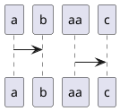

Some *Markdown*


[link](#sho)


aaaa
===

aaa

- A
- B

```golang

func main(){
    a:=0
}

```

| a | ddd |
| bbb | aaa |


hogeojo
---

### sho

[link](#sho)


- hoge
- aaa
- bbb


# 1
## 2
### 3
#### 4

