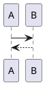

JadowMD
===

JadowMD is an alternative markdown to html documents tool.

Overview
---

JadowMD is provided as single jar file and works with jre8+,
so JadowMD has a lot of portability.
You can generate documents from markdown not with any environment managements or dependency controll but with only jre.

This tool is written in Kotlin.

Feature
---

### PlantUML support

Write a code block with the language identifier `puml`.


[demo](https://osjupiter.github.io/JadowMD/demos/jadodoc.html)


Download
---

You can get a compiled jar file from [here]().

How to Use
---

execute the following code.

```cmd
java -jar jadowmd.jar  [target markdown]
```

or

```cmd
java -jar jadowmd.jar -r [target directory]
```

[demo](https://osjupiter.github.io/JadowMD/demos/jadodoc.html) 


Now JadowMD supports a single template.


