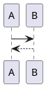

JadowMD
===

JadowMD is an alternative markdown to html documents tool.

Overview
---

JadowMD is provided as single jar file and works with jre8+,
so JadowMD has a lot of portability.
You can generate documents from markdown without annoying environment managements or dependency controll but with only jre and a single jar.

This tool is written in Kotlin.

Feature
---

### PlantUML support

Write a code block with the language identifier `puml`.


[demo](https://osjupiter.github.io/JadowMD/demos/jadodoc.html)


Download
---

You can get a compiled jar file from [Releases](https://github.com/osjupiter/JadowMD/releases).

How to Use
---

execute the following code.

```cmd
java -jar jadowmd.jar  [target markdown] -o [output file]
```

or

```cmd
java -jar jadowmd.jar -r [target directory] -o [output file]
```


[demo](https://osjupiter.github.io/JadowMD/demos/jadodoc.html) 


Now JadowMD supports a specified single template which using [bulma](https://bulma.io/) and [bulmaswatch](https://jenil.github.io/bulmaswatch/).
This template generates a single html file from multiple source markdown files.
For details, See [generated html source code](https://github.com/osjupiter/JadowMD/blob/master/docs/demos/jadodoc.html).


