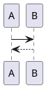

JadowMD
===

JadowMD is an alternative tool for markdown to html document.

Overview
---

JadowMD is provided as single jar file and works with jre8+,
so JadowMD has a lot of portability.
You can generate documents from markdown without neither any environment management nor dependency controll.

This tool is written in Kotlin.

Feature
---

### PlantUML support

write a code block with the language identifier `puml` language.


[demo]()


Download
---

You can get a compiled fatjar from [here]().

How to Use
---

execute the following code.

```cmd
java -jar jadowmd.jar  [target markdown]
```

or

```cmd
java -jar jadowmd.jar -r [target directory]
```

[demo]() 


Now JadowMD supports an fixed template and only supports LF.


